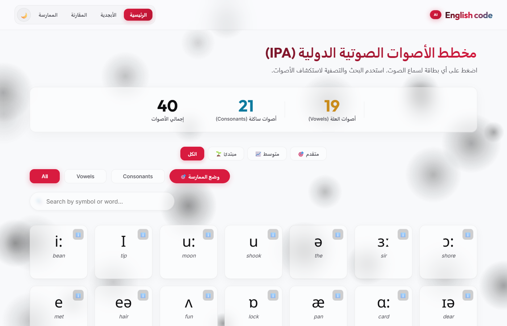
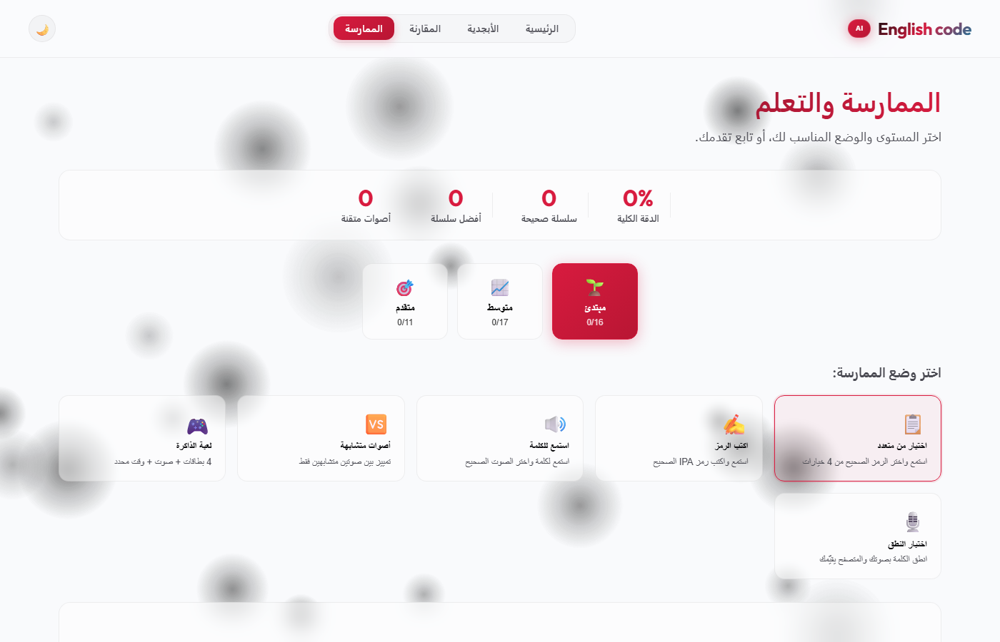
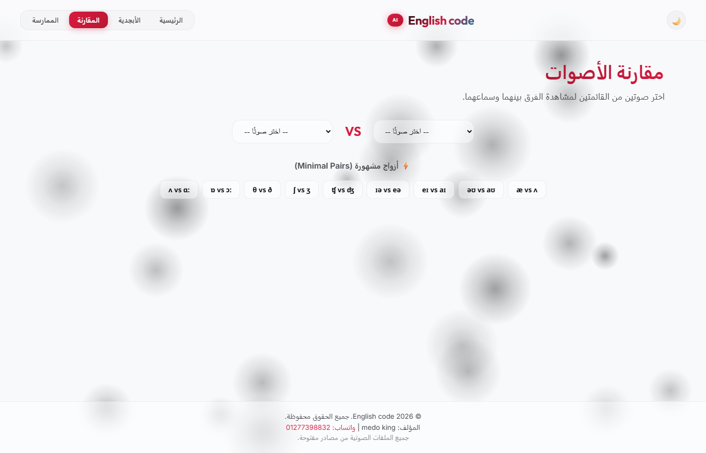
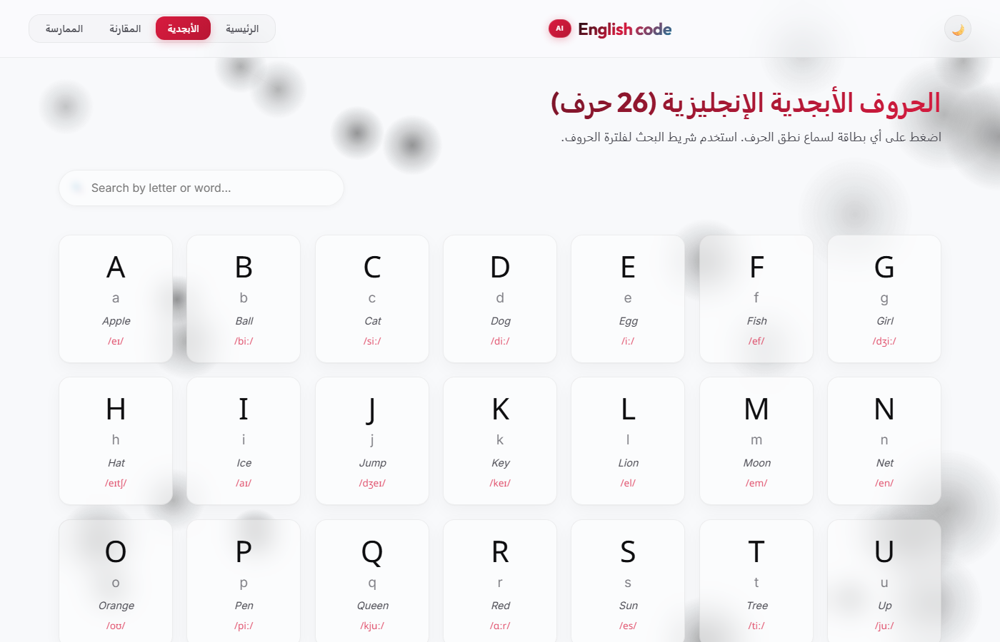

# 🗣️ جدول IPA التفاعلي للإنجليزية

**تطبيق ويب تفاعلي لتعلم الابجدية الصوتية الدولية (IPA) مع تشغيل الصوت، المقارنة، ووضع التمرين، وابراع الذاكرة.**

---

## ✨ الميزات

### 🏠 الصفحة الرئيسية (index.html)

- **40 صوت IPA** (19 علة + 21 ساكن)
- **فلاتر المستوى**: مبتدئ (16) · متوسط (17) · متقدم (12) · الكل
- **فلاتر الفئة**: الكل · حروف العلة · السواكن · وضع الممارسة
- **تشغيل الصوت** عبر Web Audio API
- **البحث** الفوري بالرمز أو الكلمة
- **إحصائيات حية** + نافذة تفصيلية
- **وضع التمرين** التفاعلي

### 🔤 صفحة الابجدية (alphabet.html)

- **26 حرف** A-Z مع النطق الصوتي
- كلمات مثال + تشغيل الصوت
- بحث وتصفية

### 🆚 صفحة المقارنة (compare.html)

- قوائم منسدلة لمقارنة صوتين
- **10 ازواج مشهورة** (Minimal Pairs)
- صور وضع الفم + شروحات

### 🎯 صفحة الممارسة (practice.html)

- اختيار المستوى مع تتبع التقدم
- **وضع متعدد الخيارات** (استمع واختر)
- **لعبة الذاكرة** (4 بطاقات + صوت + مؤقت)
- **اختيار النطق** (Speech Recognition + ميكروفون)
- **تتبع التقدم** (localStorage)

---

## 🛠️ التقنيات

- HTML5 / CSS3 / JavaScript ES6+ (Vanilla - بدون مكتبات خارجية)
- Canvas API (خلفية جسيمات)
- Web Audio API (تشغيل الصوت)
- Web Speech API (وضع النطق)
- JSON (تخزين البيانات)
- Google Fonts (Outfit, Inter, Noto Sans)

---

## 📁 هيكل المشروع

---

## 📊 ملفات البيانات

- **ipa-data.json** — 40 صوت IPA مع الكلمات والمسارات الصوتية
- **ipa-words.json** — الكلمة المثال الاساسية لكل رمز
- **ipa-descriptions.json** — ادلة النطق بالعربية
- **compare-data.json** — شروحات المقارنة المخصصة
- **alphabet-data.json** — الابجدية الانجليزية (26 حرف)
- **sentences-data.json** — 44 جملة تدريب (واحدة لكل صوت)

---

## 🧠 البنية البرمجية

- **config.js** — الاعدادات المركزية (Object.freeze)
- **data-service.js** — Singleton مع caching
- **audio-service.js** — تشغيل الصوت مع debounce
- **theme-service.js** — localStorage + theme toggle
- **sound-card-factory.js** — Factory pattern لبطاقات DOM
- **particles.js** — Canvas particle background
- **home-page.js** — البحث + التصفية + مسار التعلم
- **alphabet-page.js** — عرض الحروف
- **compare-page.js** — المقارنة + الازواج المشهورة
- **practice-page.js** — التحكم في الاختبارات
- **learning-path.js** — 3 مستويات (16+17+12)
- **advanced-practice.js** — 4+ اوضاع تدريب
- **memory-game.js** — لعبة الذاكرة
- **progress-tracker.js** — localStorage + احصائيات
- **speech-service.js** — Web Speech API + فحص الميكروفون

---

## 🎨 نظام التصميم

**الالوان**: فاتح (#f5f7fa) / داكن (#090a0f) — مميز #d81b3f — ذهبي #c98b1a — سماوي #0d7a9e

---

## 📸 لقطات الشاشة

### الرئيسية — جدول IPA

### الممارسة

### المقارنة

### الابجدية

---

## 📝 الترخيص

**MIT License** — راجع ملف [LICENSE](LICENSE).

---

## 📬 التواصل

**المستودع:** [github.com/Medo-king-01/english-ipa-chart](https://github.com/Medo-king-01/english-ipa-chart)

---

**صُنع بـ ❤️ لمتعلمي اللغات في كل مكان.**

*آخر تحديث: سبتمبر 2026*
